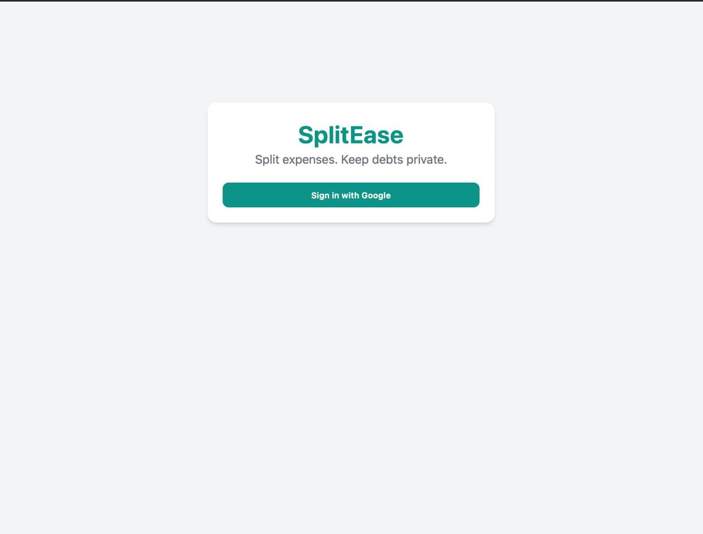
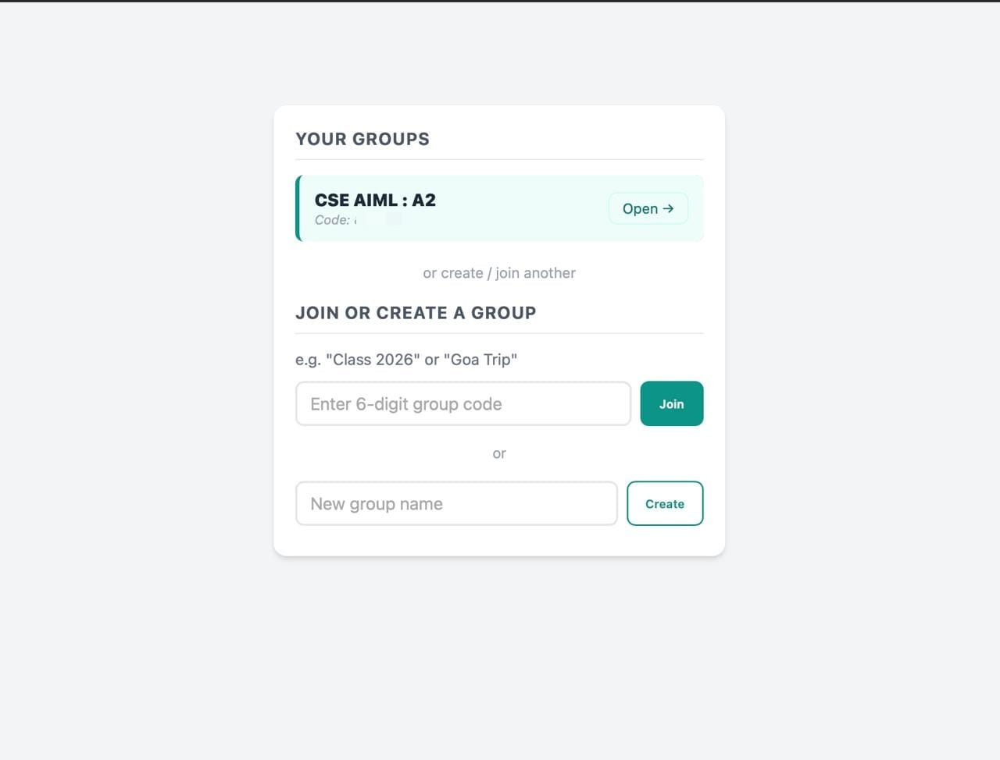
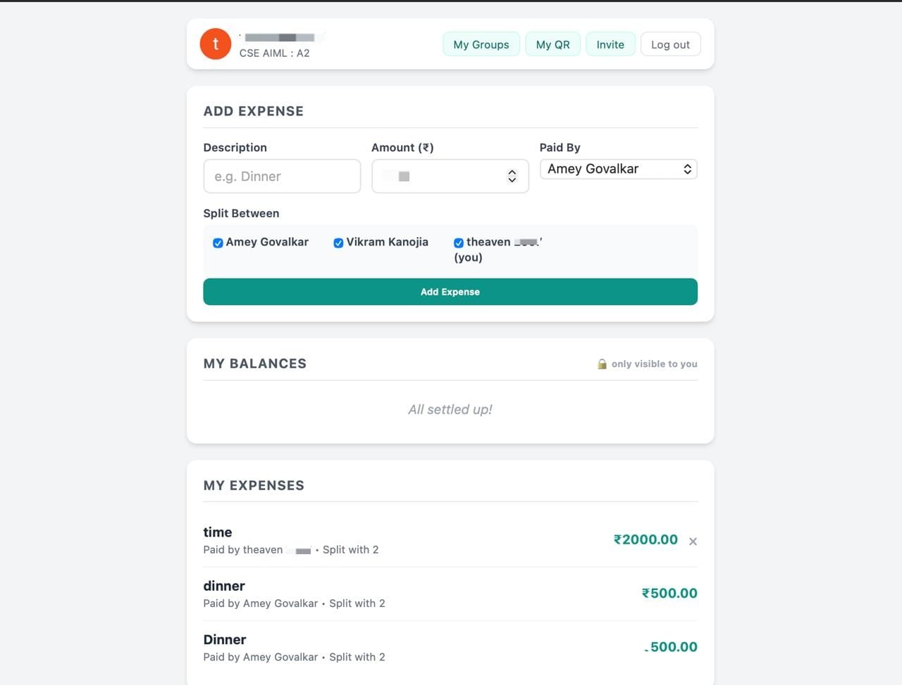

# 💸 SplitEase: Private Group Expense Splitter

> Split expenses with friends. **Keep debts private.**

SplitEase is a web app for splitting shared expenses (trips, dinners, class outings) in a group. Unlike most splitters, **nobody can see expenses they are not part of**. You only see the expenses you paid for or were split into, and the balances you owe or are owed.

Built with **HTML, CSS, JavaScript and Firebase**, and it runs entirely on Firebase's **free Spark plan**, with no credit card required.

🔗 **Live demo:** `https://splitease-amey.web.app` 

---

## ✨ Features

| Feature | Description |
|---|---|
| 🔐 **Google Sign-In** | One-click login using Firebase Authentication |
| 👥 **Groups with invite codes** | Create a group, share a 6-digit code, friends join with it |
| ➕ **Add expenses** | Description, amount (₹), who paid, and who it is split between |
| 🔒 **Private balances** | Each person only sees expenses they are involved in |
| 🧮 **Paise-accurate math** | Amounts are stored in paise (integers), and remainders are distributed fairly |
| 📱 **UPI QR payments** | Upload your UPI QR so others can scan and pay you |
| ✅ **Payment confirmation** | The payer uploads a screenshot and the receiver confirms it before the balance is cleared |
| 🛡️ **Server-side security** | Firestore rules enforce privacy, not just the UI |
| 📱 **Responsive** | Works on phones and desktops |

---

## 🧰 Tech Stack

| Layer | Technology |
|---|---|
| Frontend | HTML5, CSS3, Vanilla JavaScript (ES Modules) |
| Auth | Firebase Authentication (Google provider) |
| Database | Cloud Firestore |
| Hosting | Firebase Hosting |
| Plan | Firebase Spark (free) |

---

## 📁 Project Structure

```
splitease/
├── index.html              # 3 screens: sign-in → join/create group → main app
├── style.css               # Styling for all screens and modals
├── app.js                  # Auth, groups, expenses, balance math, pay/confirm flow
├── firebase-config.js      # Your Firebase project config (edit this)
├── firestore.rules         # Security rules: who can read/write what
├── firestore.indexes.json  # Firestore indexes (empty, none needed)
├── firebase.json           # Firebase deploy settings
└── README.md
```

---

## 🔍 How It Works

### Data model (Firestore)

| Collection | Fields |
|---|---|
| `users/{uid}` | `name`, `email`, `photoUrl`, `upiQrUrl`, `groupId` |
| `groups/{id}` | `name`, `code`, `memberIds[]`, `createdBy`, `createdAt` |
| `expenses/{id}` | `groupId`, `desc`, `amountInCents`, `payerId`, `splitWith[]`, `createdAt` |
| `payments/{id}` | `groupId`, `fromUserId`, `toUserId`, `amountInCents`, `proofUrl`, `status`, `createdAt` |

### Payment flow

```
Balance shows "You owe Priya ₹250"
        │
        ▼
  Tap "Pay" → scan Priya's UPI QR → pay in your UPI app
        │
        ▼
  Upload screenshot → "Mark as Paid"  →  payment status: pending
        │
        ▼
  Priya sees "Review" → checks screenshot → "Confirm Received"
        │
        ▼
  payment status: confirmed  →  balance updates for both
```

### Privacy model

| Data | Who can read it |
|---|---|
| An expense | Only the payer and the people it is split with |
| A payment | Only the sender and the receiver |
| A profile | The owner and members of the same group |

The app queries only the expenses and payments that involve you, and the Firestore rules **reject any other read** on the server.

### Security rules highlights

- Only the **payer** can delete an expense.
- Only the **receiver** can confirm a payment, and nothing else about the payment can be changed.
- Joining a group can only **add yourself** to `memberIds`.
- Payer and split members must all belong to the group.
- Input is validated (description length, positive integer amounts, image size limit).

---

## 🚀 Getting Started (100% free)

### Prerequisites
- A Google account
- [Node.js (LTS)](https://nodejs.org)
- Firebase CLI: `npm install -g firebase-tools`

### 1. Clone the repo
```bash
git clone https://github.com/ameygovalkar01/SplitEase.git
cd Splitease
```

### 2. Create a Firebase project
1. Open the [Firebase Console](https://console.firebase.google.com) and click **Create a project**.
2. Turn **Google Analytics off** and create the project. Stay on the free **Spark** plan.

### 3. Register a web app
1. On the project home page click the **`</>`** (Web) icon.
2. Register the app. **Do not** tick "Set up Firebase Hosting".
3. Copy the `firebaseConfig` values into **`firebase-config.js`**.

> ℹ️ These config values are **not secrets**. They only identify your project. Security comes from `firestore.rules`.

### 4. Enable Google sign-in
**Build → Authentication → Get started → Sign-in method → Google → Enable → Save**

### 5. Create the Firestore database
**Build → Firestore Database → Create database →** Standard edition, location `asia-south1` (Mumbai), **production mode**.

### 6. Deploy
```bash
firebase login
firebase use --add          # select your project, alias: default
firebase deploy --only firestore:rules,hosting
```

Your app is now live at `https://<your-project-id>.web.app` 🎉

### 7. Run locally (optional)
```bash
npx serve .
```
Open the `http://localhost:...` link. Opening `index.html` by double-click will **not** work because the app uses ES modules.

---
## 🖼️ Screenshots

| Sign in | Group | Dashboard |
|---|---|---|
|  |  |  |

## ⚠️ Known Limitations

| Limitation | Details |
|---|---|
| **Images live in Firestore** | Firebase Storage now needs a paid plan, so QR codes and payment proofs are compressed (about 200 KB max) and stored as data URLs in Firestore. |
| **Free-plan quotas** | 50K reads, 20K writes per day. Plenty for a class or trip group. When exceeded the app pauses until the next day. |
| **Group codes** | Joining by code requires signed-in users to be able to look up groups, so a signed-in user could list group codes. No expense or payment data is exposed. |
| **Creator must be involved** | An expense can only be added by someone who is the payer or is in the split. This prevents inventing debts between other people. |
| **Per-expense cap** | ₹1 crore (change it in `firestore.rules`) |

---

## 🗺️ Ideas for the Future

- Settle-up suggestions that minimise the number of payments
- Unequal splits (by percentage or exact amount)
- Expense editing and categories
- Leaving a group and removing members
- Move QR and proof images to Firebase Storage if you upgrade to Blaze

---

## 🤝 Contributing

Pull requests are welcome. For major changes, please open an issue first to discuss what you would like to change.

---

## 📄 License

Released under the [MIT License](LICENSE). *(Add a `LICENSE` file from GitHub's "Add file → Create new file → LICENSE" template.)*

---

## 👤 Author

**Amey**, CSE (AI & ML) student at VIVA Institute of Technology, Virar

- GitHub: [@ameygovalkar01](https://github.com/ameygovalkar01)
- LinkedIn: [linkedin.com/in/amey-govalkar-607952387](https://linkedin.com/in/amey-govalkar-607952387)

⭐ If you found this useful, consider starring the repo!
# SplitEase
